# Demanda de Transporte

Destacar que este material ha sido elaborado en conjunto con `Sander van Cranenburgh dentro del curso: Discrete Choice Analysis: micro-econometrics and machine learning approaches (TU Delft, 2023, 2024, 2025) y Travel Research Behaviour (TU Delft, 2025, 2026)`

Su uso es exclusivo para el curso y sus estudiantes. No se permite compartir sin previa autorización.

**Este material no forma parte de la evaluación del curso.** Su ejecución tiene como objetivo fomentar el aprendizaje en ambos lenguajes de programación y en los dos softwares más utilizados en el area de la modelación de elección discreta.

## Instrucciones para configurar tu entorno de trabajo en Python

En esta sección, te guiaremos a través de la configuración de tu entorno de Python para la parte de modelación de elección con Clases Latentes del curso. Tienes tres opciones para configurar tu entorno: Anaconda, PIP o Google Colab. Recomendamos usar Anaconda.

### A. Configuración con Anaconda

Anaconda es una plataforma popular para gestionar entornos de Python. Si usas Anaconda, se recomienda usar la versión de Python **3.11.10** para evitar problemas de compatibilidad. Otras versiones, como **3.9 o anteriores**, son conocidas por dar problemas.

Instrucciones paso a paso:

#### Instrucción 1: Creación de tu entorno de Python en Anaconda

0. **Instalar Anaconda**:
   - Ve a la [página de descarga de Anaconda](https://docs.anaconda.com/anaconda/install/).
   - Elige la versión adecuada y haz clic en Descargar.
   - Ejecuta el instalador y sigue las instrucciones.

1. **Abrir Anaconda Navigator**: Ve a la pestaña "Environments" (Entornos) en la barra lateral izquierda de Anaconda Navigator.
   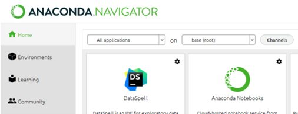

2. **Crear un nuevo entorno:** Haz clic en el botón "Create" (Crear) en la parte inferior de la ventana.

   

3. **Nombra tu entorno y elige la versión de Python**: Ingresa un nombre para tu nuevo entorno (por ejemplo, SEN1721) y selecciona la versión de Python 3.12.7 en el menú desplegable.

   

4. **Activar el entorno:** Ve a la pestaña "Home" (Inicio) en Anaconda Navigator. Deberías ver tu entorno recién creado en el lado derecho. Selecciónalo e inicia Jupyter Notebook o JupyterLab desde aquí.

   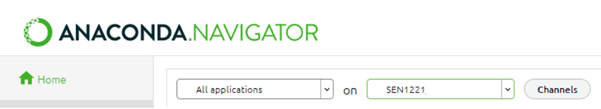

5. **Descargar y configurar los materiales del curso:** Descarga el repositorio del curso SEN1721 desde GitHub. Descomprime el archivo en un directorio de trabajo de tu elección. En su interior, encontrarás cuadernos de Jupyter, un archivo requirements.txt y conjuntos de datos.

6. **Inicia JupyterNotebook o JupyterLab y encuentra tu espacio de trabajo**: Verás el cuaderno, el archivo `requirements.txt` y la carpeta `data`.

   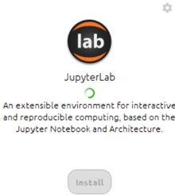

   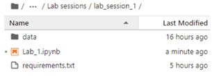

7. **Importar paquetes:** Una vez dentro del cuaderno, ubica el archivo requirements.txt y descomenta las líneas necesarias en el código de configuración provisto. Ejecuta las celdas para importar todos los paquetes requeridos. Si algunos paquetes no se instalan, reinicia el kernel y vuelve a ejecutar los comandos.

   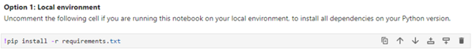

8. **Importar todos los paquetes:** Ejecuta las celdas para importar todos los paquetes requeridos.

   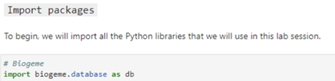

   Si algunos paquetes no se instalan, reinicia el kernel y repite los pasos: 7 y 8

   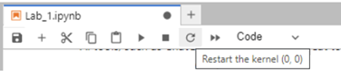

9. **Ejecutar el cuaderno**: Una vez que la configuración esté completa, estarás listo para ejecutar tu código. Los paquetes requeridos estarán instalados y podrás continuar con la tarea en clase.

#### Instrucción 2: Crear el entorno e instalar los requisitos a través de la terminal.

Si prefieres usar la terminal para gestionar tu entorno:

1. Abrir la Terminal de Anaconda: Haz clic en el botón verde de reproducción junto al nombre de tu entorno en la pestaña "Environments" (Entornos) para abrir una terminal.

   

2. **Crear un nuevo entorno:** Haz clic en el botón "Create" (Crear) en la parte inferior de la ventana.

   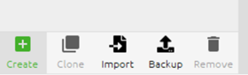

3. **Configurar el nuevo entorno:** Ingresa un nombre para tu nuevo entorno, por ejemplo, "SEN1721", y elige la versión de Python == "3.12.7" en el menú desplegable.

   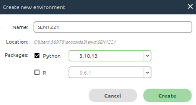

4. **Activar el entorno:** Haz clic en el botón verde de "Reproducción" en el lado derecho del nombre del entorno para abrir una terminal donde el entorno esté activado.

   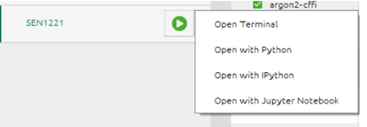

5. **Verificar la versión de Python:** Puedes ejecutar `python --version` en la terminal.

   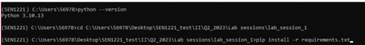

6. **Navegar a la carpeta del proyecto:** Usa el comando `cd` para navegar a la carpeta del proyecto, por ejemplo, `cd …/…/…/Q2_2024`.

   

7. **Instalar el archivo de requisitos:** Ahora, puedes instalar el archivo `requirements.txt` dentro del entorno activado usando el siguiente comando: `pip install -r requirements.txt`

   

8. **Instalar e iniciar JupyterNotebook/JupyterLab**

   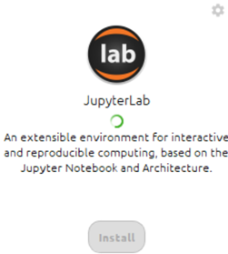

9. **Importar todos los paquetes**

   

10. **Ejecutar el cuaderno**: Una vez que la configuración esté completa, estarás listo para ejecutar tu código. Los paquetes requeridos estarán instalados y podrás continuar con la tarea en clase.

### B. Configuración con PIP (Gestor de Paquetes de Python)

Si no usas Anaconda, puedes configurar tu entorno usando PIP, que es el gestor de paquetes predeterminado para Python.

Instrucciones paso a paso:

1. **Asegúrate de tener Python 3.10 o superior:** Confirma que tienes Python instalado en tu sistema (se recomienda de la versión 3.10 a la 3.12). Puedes verificar tu versión de Python ejecutando `python --version` en tu terminal. Además, asegúrate de haber configurado un entorno IPython en tu computadora (Jupyter, VSCode o cualquier alternativa).

2. **Clonar o descargar el repositorio:** Descarga el repositorio del curso desde GitHub. Descomprímelo en una carpeta de trabajo.
3. **Instalar requisitos:** Ahora tienes dos opciones: (a) Instalar dependencias separadas de tu versión actual de Python; (b) Instalar dependencias para este cuaderno en tu versión de Python (manera fácil):
   - Opción a: (para aquellos familiarizados con entornos de Python):
     - Abre tu terminal y navega a la carpeta del curso.
     - Crea un nuevo "entorno virtual" (un espacio de trabajo separado para este curso).
     - Instala los paquetes requeridos listados en el archivo `requirements.txt` dentro de este entorno.
   - Opción b: (la manera más fácil; para personas no familiarizadas con entornos de Python):
     - Abre el cuaderno de Python en el que quieres trabajar (Paso 1).
     - Descomenta la línea relacionada con el uso de una configuración local y ejecútala (ve la figura a continuación).
     - Vuelve a comentar las líneas para evitar reinstalar las dependencias cada vez que ejecutes el cuaderno.
       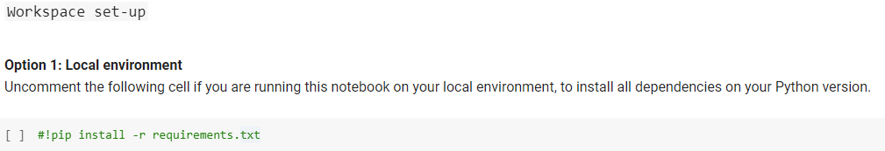

   - Instrucciones para crear un nuevo entorno virtual (si eliges la opción a):
     - Abre tu símbolo del sistema o terminal.
     - Navega al directorio donde quieres crear el entorno.
     - Escribe: `python -m venv myenv` (Reemplaza `myenv` con el nombre que elijas para tu entorno).
     - Activa el entorno (en Windows, escribe: `myenv\Scripts\activate`; en MacOS/Linux, escribe: `source myenv/bin/activate`).
     - Instala los requisitos desde un Archivo. Con tu entorno activado, navega a la carpeta que contiene el archivo `requirements.txt` y ejecuta: `pip install -r requirements.txt`.

4. **Abrir el cuaderno**: Inicia Jupyter Notebook, JupyterLab u otra herramienta IPython (por ejemplo, VSCode), y asegúrate de estar ejecutando el cuaderno dentro del entorno virtual recién creado.
